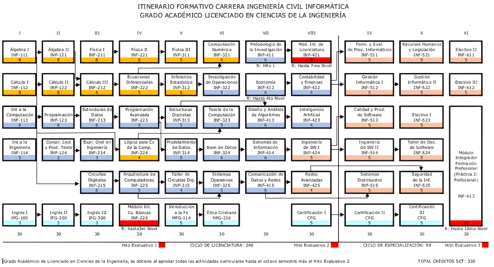

# Repositorio de Materiales Universitarios - Ingeniería Civil Informática

Este repositorio contiene una recopilación de materiales, códigos, apuntes y recursos recolectados durante mi estadía en la carrera de Ingeniería Civil Informática. Se organiza siguiendo la malla curricular oficial de la carrera.

## Estructura del Repositorio

La organización sigue un formato `SXXEXX` donde:
- **S** = Año académico (Season)
- **E** = Semestre (Episode)

Por ejemplo: `S02E01` corresponde al primer semestre del segundo año.

## Malla Curricular Completa

### Primer Año
- **S01E01**: Primer semestre
  - Álgebra I (INF-111)
  - Cálculo I (INF-112)
  - Introducción a la Computación (INF-113)
  - Introducción a la Ingeniería (INF-114)
  - Inglés I (IFG-100)

- **S01E02**: Segundo semestre
  - Álgebra II (INF-121)
  - Cálculo II (INF-122)
  - Programación (INF-123)
  - Comprención Lectora y Producción de Textos (INF-124)
  - Inglés II (IFG-200)

### Segundo Año
- **S02E01**: Primer semestre
  - [Física I (INF-211)](./S02E01/Física%20I) ✓
  - [Cálculo III (INF-212)](./S02E01/Cálculo%203) ✓
  - [Estructura de Datos (INF-213)](./S02E01/Estructura%20de%20datos) ✓
  - Expresión Oral en Ingeniería (INF-214)
  - [Circuitos Digitales (INF-215)](./S02E01/Circuitos%20digitales) ✓
  - Inglés III (IFG-300)

- **S02E02**: Segundo semestre
  - [Física II (INF-221)](./S02E02/Física%20II) ✓
  - [Ecuaciones Diferenciales (INF-222)](./S02E02/Ecuaciones%20diferenciales) ✓
  - [Programación Avanzada (INF-223)](./S02E02/Programación%20avanzada) ✓
  - [Lógica para Cs. de la Computación (INF-224)](./S02E02/Lógica%20para%20ciencias%20de%20la%20computación) ✓
  - [Arquitectura de Computadores (INF-225)](./S02E02/Arquitectura%20de%20computadores) ✓
  - Módulo Integrador Competencias Básicas (INF-226)
  

### Tercer Año
- **S03E01**: Primer semestre
  - [Física III (INF-311)](./S03E01/Física%20III) ✓
  - [Inferencia Estadística (INF-312)](./S03E01/Inferencia%20Estadística) ✓
  - [Estructuras Discretas (INF-313)](./S03E01/Estructuras%20discretas) ✓
  - [Modelamiento de Datos (INF-314)](./S03E01/Modelamiento%20de%20datos) ✓
  - Taller de Circuitos Digitales (INF-315)
  - Introducción a la Fe (INF-315)

- **S03E02**: Segundo semestre
  - [Computación Numérica (INF-321)](./S03E02/Computación%20numérica) ✓
  - [Investigación de Operaciones (INF-322)](./S03E02/Investigación%20de%20operaciones) ✓
  - [Teoría de la Computación (INF-323)](./S03E02/Teoría%20de%20la%20computación) ✓
  - [Base de Datos (INF-324)](./S03E02/Base%20de%20datos) ✓
  - [Sistemas Operativos (INF-325)](./S03E02/Sistemas%20operativos) ✓
  - Ética Cristiana (INF-216)
  

### Cuarto Año
- **S04E01**: Primer semestre
  - Metodología de la Investigación (INF-411)
  - [Economía (INF-412)](./S04E01/Economía) ✓
  - [Diseño y Análisis de Algoritmos (INF-413)](./S04E01/Diseño%20y%20análisis%20de%20algoritmos) ✓
  - Sistemas de Información (INF-414)
  - Comunicación de Datos y Redes (INF-415)
  
- **S04E02**: Segundo semestre
  - Módulo Integrador de Licenciatura (INF-421)
  - [Contabilidad y Finanzas (INF-422)](./S04E02/Contabilidad%20y%20finanzas) ✓
  - [Inteligencia Artificial (INF-423)](./S04E02/Inteligencia%20artificial) ✓
  - [Ingeniería de Software I (INF-424)](./S04E02/Ingeniería%20de%20software%20I/) ✓
  - Redes Avanzadas (INF-425)

### Quinto Año (Especialización)
- **S05E01**: Primer semestre
  - Formulación y Evaluación de Proyectos Informáticos (INF-511)
  - Gestión Informática I (INF-512)
  - Calidad y Productividad de Software (INF-513)
  - Ingeniería de Software II (INF-514)
  - Sistemas Distribuidos (INF-515)

- **S05E02**: Segundo semestre
  - Recursos Humanos y Legislación (INF-521)
  - Gestión Informática II (INF-522)
  - Taller de Desarrollo de Software (INF-524)
  - Seguridad de la Información (INF-525)

## Contribuciones

Este repositorio está abierto a contribuciones. Si tienes materiales de alguno de los cursos que no están marcados con ✓, siéntete libre de hacer un pull request para añadirlos.

## Tipos de contenido

El repositorio incluye principalmente:
- Códigos fuente y proyectos en diversos lenguajes de programación
- Ejercicios resueltos
- Libros de referencia (en algunas carpetas)

---

*Este repositorio está under construction*

Gracias Claudio por hacerme el readme