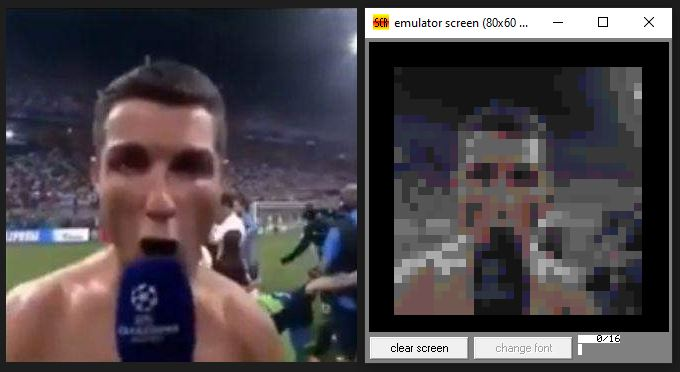
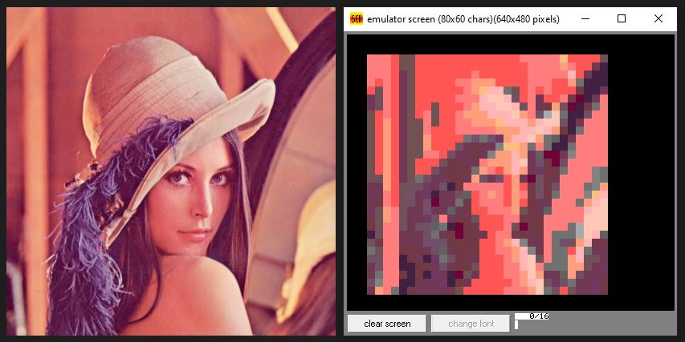
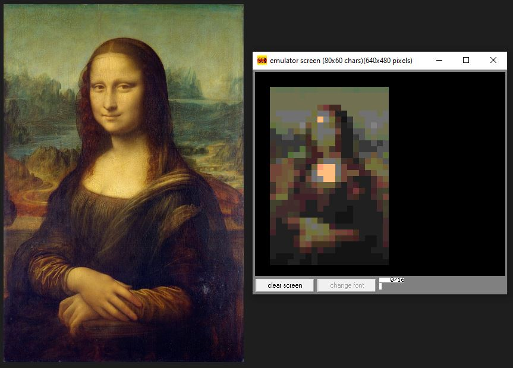
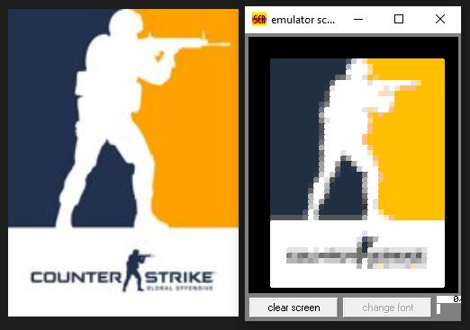

## Dibujado en 8086

* Usando Python transforma una imagen de entrada (se añade a img y se edita app.py) en instrucciones 8086 que hacen uso de un macro predefinido en el_pinturas.asm
* Las instrucciones son generadas en macro_8086.txt
* Las instrucciones deben ser pegadas en el cuerpo de el_pinturas.asm

Por tiempo empleado, no se recomienda usar más de 600 líneas.  
-       600 líneas = ~ 1-2h compilación (?)                         
El tiempo de dibujado **depende del largo del cuadrado** a pintar. 
-       Con largo = 8 y 600 líneas = ~ 2h de dibujado         

RECALCULA EL LARGO DE LA NUEVA IMAGEN EN PIXELES.
DEFINE EL LARGO QUE TENDRÁ EL LADO MÁS LARGO DE LA IMAGEN.

EJ: SI LARGER_SIDELARGER_SIDE = 34, ENTONCES 340X200 PX, PASARÁ A SER ---> 34X20

-       Aquello da 680 líneas de código llamando a la macro "rectangulo".

Se utiliza una función para juntar las celdas del mismo color dentro de una fila y así reducir la cantidad de líneas. El resultado depende de la imagen.

### Resultados

*       CR7, 31x31 con bloques de 8

*       Lena, 30x10

*       Mona Lisa, 32x21

*       Logo CS

