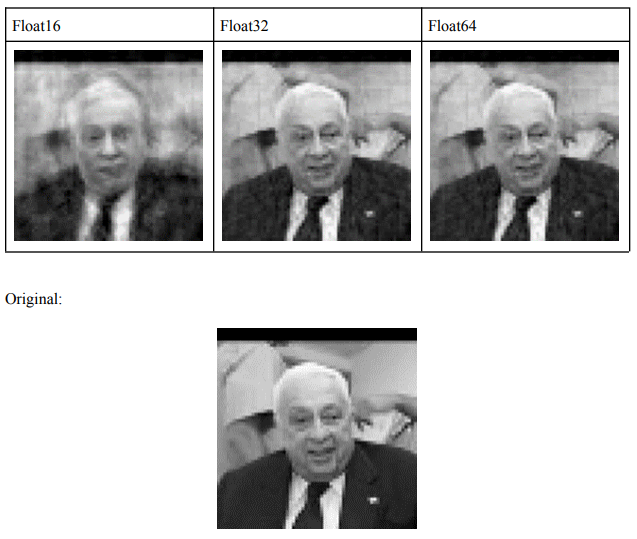

## Eigenfaces

### Objetivos
- 1.1 Construya una base de datos de rostros reales e implemente el algoritmo
PCA.
- 1.2 Eval´ue el error de reconstrucci´on para distintos valores del n´umero de componentes principales.
- 1.3 Implemente una versi´on de PCA cuantizada y eval´ue el error
de clasificaci´on al momento de realizar reconocimiento de rostros.

